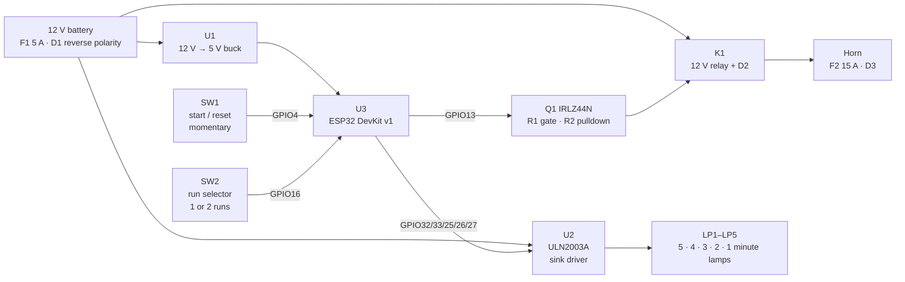
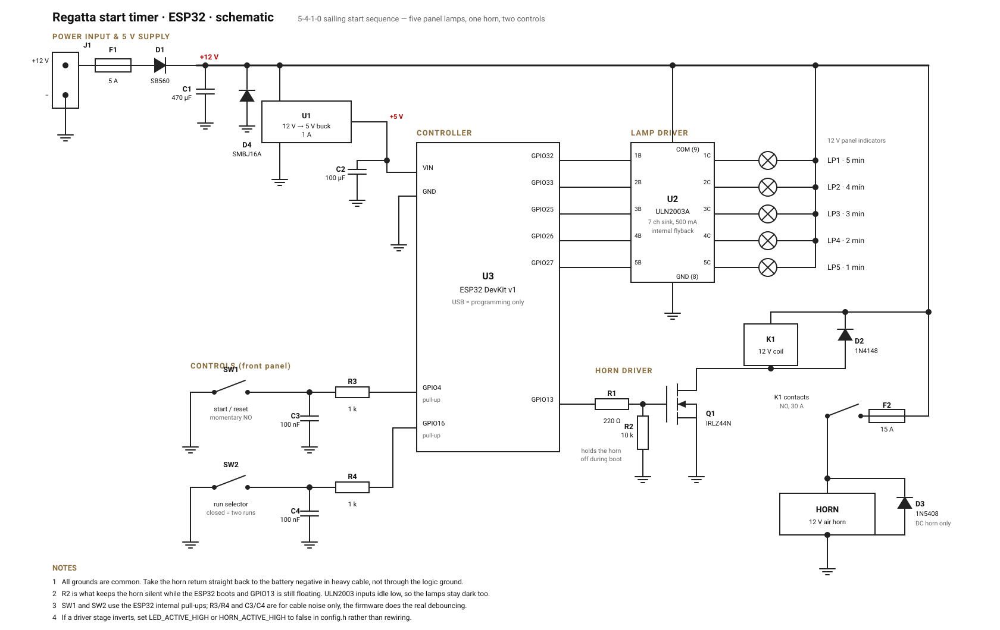

# Hardware

Circuit diagram and parts list for the regatta start timer. The firmware pin
map lives in `RegattaTimer/config.h`; everything here matches it.

The design assumes a committee boat or a start hut running off a 12 V battery,
five 12 V panel indicator lamps, and a 12 V air horn or klaxon. Nothing beyond
the ESP32 needs a regulated supply.

## Block diagram

## Schematic

The full-size drawing is [`schematic.svg`](schematic.svg).

## Bill of materials

### Control and drive

| Ref | Qty | Part | Notes |
|---|---|---|---|
| U3 | 1 | ESP32 DevKit v1 (30-pin, ESP-WROOM-32) | Any ESP32 dev board works; keep the pin map or edit `config.h`. USB is only for programming |
| U2 | 1 | ULN2003A (DIP-16) | 7 sinking channels, 500 mA each, flyback diodes built in. ULN2803 is a drop-in with 8 channels |
| U1 | 1 | 12 V → 5 V buck module, ≥ 1 A | LM2596 module, or a Pololu D24V10F5 for less noise. Feeds the ESP32 `VIN` pin |
| Q1 | 1 | IRLZ44N logic-level N-MOSFET (TO-220) | Switches the relay coil. Logic level matters — a plain IRF540 will not turn on from 3.3 V |
| K1 | 1 | 12 V automotive relay, SPST-NO, 30 A | Bosch-style cube relay plus a socket with flying leads |

### Passives and protection

| Ref | Qty | Part | Notes |
|---|---|---|---|
| R1 | 1 | 220 Ω, ¼ W | Gate series resistor |
| R2 | 1 | 10 kΩ, ¼ W | **Gate pulldown — do not omit.** Holds the horn silent while the ESP32 boots and GPIO13 is still floating |
| R3, R4 | 2 | 1 kΩ, ¼ W | Series protection on the two control inputs |
| C1 | 1 | 470 µF, 25 V electrolytic | Bulk on the 12 V rail, near the buck input |
| C2 | 1 | 100 µF, 10 V electrolytic | Bulk on the 5 V rail |
| C3, C4 | 2 | 100 nF ceramic | Noise filtering at the control inputs |
| D1 | 1 | SB560 Schottky, 5 A 60 V | Reverse-polarity protection. A P-channel MOSFET wastes less if you care |
| D2 | 1 | 1N4148 | Flyback across the relay coil |
| D3 | 1 | 1N5408, 3 A | Flyback across the horn. Needed only if the horn is a DC coil klaxon; a compressor-driven air horn does not need it |
| D4 | 1 | SMBJ16A TVS | Clamps alternator and starter-motor spikes on a boat supply |
| F1 | 1 | 5 A blade fuse + inline holder | Logic side |
| F2 | 1 | 15 A blade fuse + inline holder | Horn side. Match the fuse to the horn, not to the wire you happen to have |

### Panel and enclosure

| Ref | Qty | Part | Notes |
|---|---|---|---|
| LP1–LP5 | 5 | 22 mm 12 V LED panel indicator | ~20 mA each. Colour is up to you; green 5-4-3-2 and red for the 1 minute lamp reads well at distance |
| SW1 | 1 | 22 mm momentary pushbutton, NO | Start / reset. One tap does everything, so make it the big one |
| SW2 | 1 | SPST toggle or rotary switch | Run selector. Closed to GND = two runs |
| J1 | 1 | 2-way screw terminal | 12 V in |
| J2 | 1 | 6-way screw terminal | Five lamp returns + common 12 V |
| J3 | 1 | 3-way screw terminal | SW1, SW2, GND |
| J4 | 1 | 2-way screw terminal, ≥ 20 A | Horn out |
| — | 1 | IP65 ABS enclosure, ~200 × 120 × 75 mm | It will get wet |
| — | 3–4 | Cable glands | Power, horn, panel loom |
| — | 1 | Perfboard + 2 × 19-pin socket strips | Socket the ESP32 so you can swap it |
| — | 1 | 16-pin DIP socket | For U2 |
| — | — | 22 AWG hookup wire | Logic and lamps |
| — | — | 14 AWG (or heavier) wire, ring terminals | Horn feed and return |

Everything except the horn wiring is small-signal; a single 100 × 80 mm piece
of perfboard holds U1, U2, Q1 and all the passives comfortably.

## Net list

Wire it from this table and check it against the schematic.

| From | To | Notes |
|---|---|---|
| J1 `+` | F1 → D1 anode | |
| D1 cathode | +12 V rail | Rail feeds U1, U2 `COM`, the lamp bus, K1 coil, F2 |
| J1 `−` | Common ground | Single star point, see below |
| U1 `OUT` | U3 `VIN` | 5 V |
| U1 `GND`, U2 `GND` (8), U3 `GND` | Common ground | |
| U3 `GPIO32` | U2 `1B` | 5 minute lamp |
| U3 `GPIO33` | U2 `2B` | 4 minute lamp |
| U3 `GPIO25` | U2 `3B` | 3 minute lamp |
| U3 `GPIO26` | U2 `4B` | 2 minute lamp |
| U3 `GPIO27` | U2 `5B` | 1 minute lamp |
| U2 `1C`–`5C` | LP1–LP5 `−` | |
| LP1–LP5 `+` | +12 V rail | Common lamp bus |
| U2 `COM` (9) | +12 V rail | Flyback return |
| U3 `GPIO13` | R1 → Q1 gate | R2 from gate to ground |
| Q1 drain | K1 coil `−` | D2 cathode to coil `+` |
| K1 coil `+` | +12 V rail | |
| Q1 source | Common ground | |
| +12 V rail | F2 → K1 contact `NO` | |
| K1 contact `COM` | J4 horn `+` | |
| J4 horn `−` | Battery negative | Heavy cable, straight back |
| U3 `GPIO4` | R3 → SW1 → ground | C3 from the switch node to ground |
| U3 `GPIO16` | R4 → SW2 → ground | C4 from the switch node to ground |

## Power budget

| Load | Current at 12 V | When |
|---|---|---|
| ESP32 + buck | ~40 mA | Always |
| Five lamps | ~100 mA | Only during the all-flash at a start |
| Relay coil | ~150 mA | Only while the horn sounds |
| Horn | 10–20 A | Blasts of 1 s or 3 s, six times per sequence at most |

Everything but the horn draws well under half an amp, so a 7 Ah SLA runs a full
day of racing. Size the battery for the horn: a 3 s blast at 15 A is about
12 mAh, which is nothing, but the peak inrush is real — do not run the horn
through a bench supply that folds back.

## Build notes

**Grounding.** Take one star point at the battery negative. The horn return in
particular must go straight back there in heavy cable and never through the
logic ground; twenty amps down a shared thin ground will brown out the ESP32
mid-sequence.

**Boot behaviour.** The one part of this circuit you cannot skip is R2. The
ESP32 leaves GPIO13 floating for the first fraction of a second after power-up
and after every reset, and a floating MOSFET gate is a horn blast at the worst
possible moment. The lamp side is safe by construction: ULN2003 inputs read as
off when floating, so the lamps stay dark through boot with no extra parts.

**Pin choice.** The GPIOs in `config.h` avoid the flash pins (6–11), the
input-only pins (34–39) and the strapping pins (0, 2, 5, 12, 15). If you
re-map, keep clear of all three groups — GPIO12 in particular will stop the
board booting if something holds it high.

**Active levels.** If you build a driver stage that inverts — a PNP-based lamp
driver, or an SSR with an inverted input — set `LED_ACTIVE_HIGH` or
`HORN_ACTIVE_HIGH` to `false` in `config.h` rather than rewiring.

**Debouncing.** SW1 and SW2 use the ESP32's internal pull-ups, so no external
pull-up is needed. R3/R4 and C3/C4 are there for long panel looms picking up
noise; the firmware does the real debouncing (`DEBOUNCE_MS`) and also debounces
the selector flip so switch bounce cannot throw away a pending recall count.

## Substitutions

**Solid state relay instead of Q1 + K1.** A DC SSR rated for the horn current
simplifies the horn side to one part. Drive its input from GPIO13 through R1,
and keep R2 across the input — the boot problem does not go away.

**Direct MOSFET, no relay.** Q1 can switch the horn directly if it is small,
but an IRLZ44N at 15 A dissipates about 5 W and needs a real heatsink. The
relay keeps the current off the board and is worth the two extra parts.

**Discrete lamp drivers instead of U2.** Five 2N7000s, each with a 220 Ω gate
resistor and a 100 kΩ pulldown, do the same job. You then have to add your own
flyback diodes if the lamps are filament or relay-fed.

**5 V lamps or LED strip.** Move the lamp bus from +12 V to the 5 V rail and
size the buck for the extra current. The ULN2003 does not care.

**Incandescent panel lamps.** A 12 V 5 W bulb pulls ~420 mA, still inside one
ULN2003 channel, but do not run all five continuously from one package — the
total package dissipation, not the per-channel rating, is the limit. Prefer LED
indicators.

## Bench test before the horn goes on

1. Power up with the horn disconnected and a multimeter on GPIO13. It should
   read 0 V from the instant power is applied, through boot, and stay there
   until the first signal.
2. Substitute a 12 V lamp for the horn and run a full sequence. You should see
   one 1 s flash at 0:00, 1:00 and 5:00, and one 3 s flash at 4:00.
3. Check the lamp order against the countdown on the serial monitor at 115200
   baud before anyone relies on it on the water.
4. Only then fit the horn, with F2 in place.
